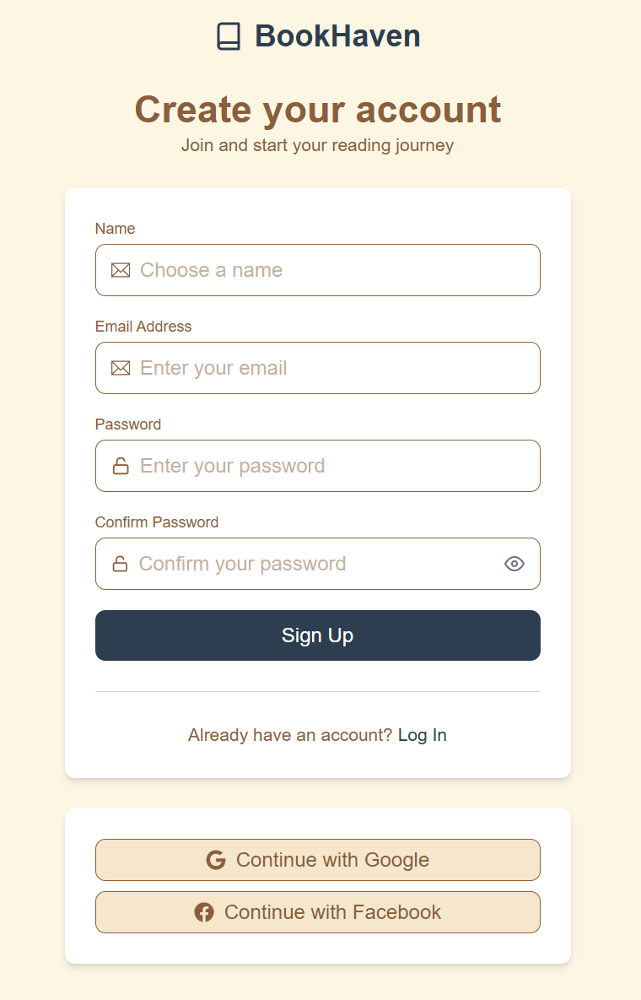
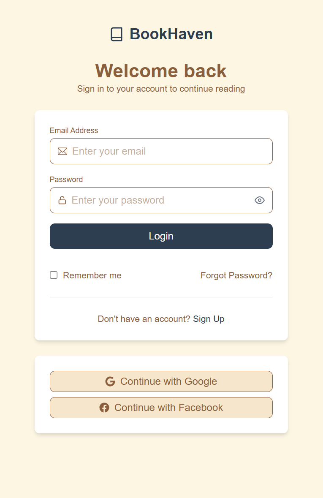
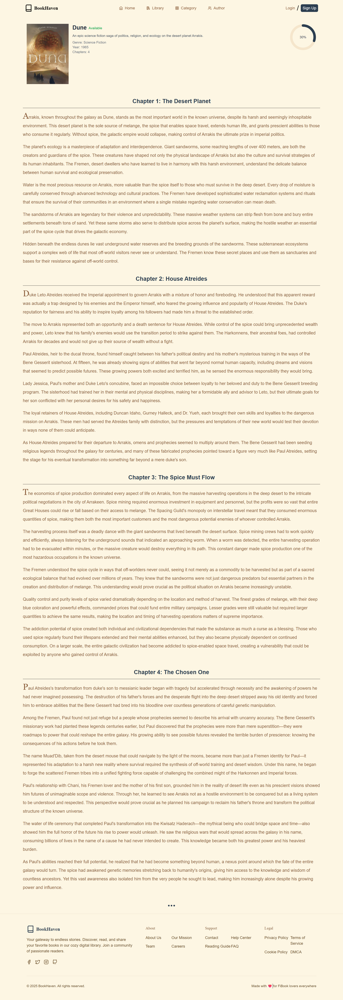

# 📖 BookHeaven — Frontend
Demo Link: `https://bookheaven-1-2r5o.onrender.com/`


##### A modern, beautifully crafted web application inspired by _Goodreads_, where users can browse books, manage their reading progress, and enjoy immersive reading experiences online.

## 💡 Pages Overview

### 🏠 Home Page

> An elegant landing page that welcomes users to BookHeaven, with featured books, categories, popular authors, and overall platform statistics.


---

### 🔐 Authentication Pages (Login / Signup)

> Clean and user-friendly **Login** and **Signup** screens allowing users to securely access their accounts with form validation and social-auth buttons (Google/Facebook).




---

### 📚 All Books Page


> A paginated and filterable listing of all available books. Users can search, sort by rating, filter by genre/category, and quickly explore the BookHeaven collection.

---

### 📖 Read Book Content Page



> A full reading experience where the user can open a specific book, view details (title, author, genre, progress, etc.), and read chapter-wise content directly in the browser.

# 🚀 Frontend Setup Guide — BookHeaven

Follow these quick steps to run the **BookHeaven Frontend** locally on your machine:

---

### 📁 1. Clone the Repository

```bash
git clone git@github.com:utkarsh032/BookHeaven.git
cd BookHeaven/frontend
npm install
npm run dev
```

# 📚 Book Heaven Backend

` API : "https://bookheaven-a8my.onrender.com"`

## 🚀 Overview

Book Heaven is a **GoodReads-inspired** backend API built with **Node.js, Express, and MongoDB**.  
It supports **user authentication**, **book management**, and **tracking reading progress**.

---

## 🛠 Tech Stack

- **Node.js** + **Express** (Server)
- **MongoDB** + **Mongoose** (Database)
- **JWT** (Authentication)
- **bcryptjs** (Password hashing)
- **dotenv** (Environment variables)

---

## 📦 Installation & Setup

### 1️⃣ Clone the repository

```bash
git clone git@github.com:utkarsh032/BookHeaven.git
cd ./backend
```

### 2️⃣ Install dependencies

```
npm install
```

### 3️⃣ Create .env file

```
PORT=5000
MONGO_URI=mongodb://127.0.0.1:27017/book_tracker
JWT_SECRET=your_jwt_secret
```

### 4️⃣ Start the server

```
npm run dev
```

---

## 📍 API Endpoints

###### 🔑 Auth Routes

| Method | Endpoint             | Description             | Auth Required |
| ------ | -------------------- | ----------------------- | ------------- |
| POST   | `/api/auth/register` | Register a new user     | ❌            |
| POST   | `/api/auth/login`    | Login and get JWT token | ❌            |

##### 📚 Books Routes

| Method | Endpoint         | Description             | Auth Required |
| ------ | ---------------- | ----------------------- | ------------- |
| GET    | `/api/books`     | Get all books           | ❌            |
| GET    | `/api/books/:id` | Get single book details | ❌            |

###### 📖 My Books Routes

| Method | Endpoint                      | Description                | Auth Required |
| ------ | ----------------------------- | -------------------------- | ------------- |
| GET    | `/api/mybooks`                | Get logged-in user's books | ✅            |
| POST   | `/api/mybooks/add/:bookId`    | Add a book to user's list  | ✅            |
| PATCH  | `/api/mybooks/status/:bookId` | Update reading status      | ✅            |
| PATCH  | `/api/mybooks/rating/:bookId` | Update book rating         | ✅            |
| DELETE | `/api/mybooks/remove/:bookId` | Remove book from list      | ✅            |
